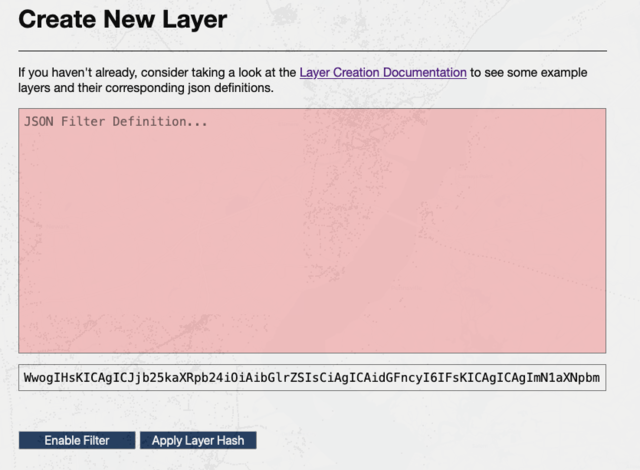

## Basic Usage

[Tiles](https://tiles.maphub.dev/index.html) allows users to explore hundreds of GB of OpenStreetMap data in the browser and selectively filter data based on object tags. You can navigate the map with the arrow keys, and adjust zoom with &#8679; + &uarr; and  &#8679; + &darr;.

OSM breaks data out into 4 categories, `Roads`, `Lines`, `Points`, and `Polygons`. You can use the **Select Active Layer** dropdown at the top of the screen to toggle between these options.

Hovering over any OSM object rendered on the map will cause a pop-up with the object's tags to appear, see Figure 0.1


----------------------

## Layer Creation Documentation

The **Apply Layer Filter** tab allows you to write rules that modify which OSM objects **`https://api.maphub.dev`** returns. Each layer can be defined as a json array of "rules", where each "rule" has the format defined below. 

```json
{
    "condition": "<str>", 
    // Apply Only to Inclusion/Exclusion comparison types
    "tags": ["<str>", "..." ],
    // Apply Only to Value comparison types
    "tag": "<str>",
    "value": "<str>",
}
```

* `comparison` &mdash; One of the `"Comparison"` filters listed in `Table 1.1`
* `tag` &mdash; An OSM tag - Valid for value comparisons
* `value` &mdash; An OSM tag - Valid for value comparisons
* `tags` &mdash; Array of OSM tags - Only Valid for inclusion/exclusion comparisons

<center>
| Comparison   |Type | Comparison Code | Description - Object has...                                                                        |
|------------------ |---------|-----------------|-------------------------------------------------------------------------------------|
| Equals            |Value| `"eq"`           | ${tag} with value = ${value}                 |
| NotEquals         |Value| `"noteq"`           | ${tag} with value != ${value}                 |
| GreaterThanOrEqual|Value| `"gte"`           | ${tag} with value >= ${value} |
| GreaterThan       |Value| `"gt"`           | ${tag} with value  > ${value}             |
| LessThanOrEqual   |Value| `"lte"`           | ${tag} with value <= ${value}    |
| LessThan          |Value| `"lt"`           | ${tag} with value < ${value}                |
| Like          |Value| `"like"`           | ${tag} matching the regex pattern ${value}                |
| AllExist          |Inclusion/Exclusion| `"allof"`           | all tags in ${tags}                                         |
| OneExist          |Inclusion/Exclusion| `"oneof"`           | one or more of the tags in ${tags}                         |
Table: Table  1.1 Valid Comparison Filters
</center>


Because this database is hosted on a robust instance with good geospatial indexing performance, there is no need to give up disk space materializing user's requests for filtered layers for the sake of performance. You can think of these filters as no different than the addition of an `AND...` or  `WHERE...` clause into a SQL query.

### Inclusion/Exclusion Filter Rules

The `allof` and `oneof` rules only use the `condition` and `tags` keys. A `oneof` rule requires that an object have one or more of a set of tags present. An `allof` rule requires that object has all of the listed tags. Unfortunately, querying by wildcard is not possible. For example, many roads include a `cycleway` (or similar) tag, all similar tags **cannot** be queried with `cycleway*`. In cases like these a query like the below is most likely to pick-up on a wide-range of tags used to describe cycling lanes.

```json
[
  {
    "condition": "oneof",
    "tags": [
      "cycleway",
      "cycleway:right",
      "cycleway:left",
      "cycleway:north",
      "cycleway:south",
      "cycleway:east",
      "cycleway:west"
    ],
  }
]
```

### Value Filter Rules

The `eq`, `noteq`, `gt`, `gte`, `lt`, `lte`, and `like` rules use the `condition`, `tag`, and `value` keys. Because OSM tags have no standard format, filters checking for equality or comparison may return somewhat unexpected results. For example, the following rule may not pick up values like `"10"` or `"10mph"`.

```json
[
  {
    "condition": "gte",
    "tags": [
      "speed"
    ],
    "value": "10 mph"
  }
]
```

Luckily, the `like` comparison rule offers the ability to query values using regex pattern matching, see the PostgreSQL regex [documentation](https://www.postgresql.org/docs/13/functions-matching.html) for the exact syntax for pattern matching. For example, the query below returns all restaurants with a `"cuisine"` tag ending in `an` (e.g. tags such as `"mexican"`, `"italian"`, `"korean"`, and `"american"` all appear in the return layer)

```json
[
  {
    "condition": "like",
    "tags": [
      "cuisine"
    ],
    "value": "*an"
  }
]
```

### Multiple Filters

Rules are combined into layers with an `AND` operator. For example, the following layer request fetches all OSM objects with:

* A tag named `"cuisine"` and value `"italian"` AND either a `"website"` or `"wikipedia"` tab

```json
[
  {
    "condition": "eq",
    "tag": "cuisine",
    "value": "italian"
  },
  {
    "condition": "oneof",
    "tags":["website", "wikipedia"]
  }
]
```

* At least one tag named `"cycleway"`, `"cycleway:right"`, or `"cycleway:left"`, AND a tag named `"speed"` with a value > `"30mph"`

```json
[
  {
    "condition": "oneof",
    "tags": [
      "cycleway",
      "cycleway:right",
      "cycleway:left"
    ]
  },
  {
    "condition": "gt",
    "tags": [
      "speed"
    ],
    "value": "30mph"
  }
]
```

## Sharing

The "Apply Layer Filter" interface has two buttons that make communicating custom OSM layer definitions between users easier.

* A button labelled **Enable Filter** filters all requests made to `https://tiles.maphub.dev/` with the logic currently in the JSON definition box. Clicking this button again will disable the filter. This parameter is (not so cleverly) just the `base64` encoding of the filter JSON. While this is not the most elegant solution, it allows for quick sharing of layer definitions.

* After you enter a JSON definition, a box below the main JSON area will populate with the b64 encoding of the layer. The **Apply Layer Hash** button reverses this, and takes whatever content is in the hash area and populates the JSON rule. For example, If a colleague shares the string below I can drop it into the b64 box, and decode it into the JSON definition from figure X.X earlier in this document.

Example String:
`WwogIHsKICAgICJjb25kaXRpb24iOiAibGlrZSIsCiAgICAidGFncyI6IFsKICAgICAgImN1aXNpbmUiCiAgICBdLAogICAgInZhbHVlIjogIiphbiIKICB9Cl0=`

Before         |  After
:-------------------------:|:-------------------------:
 |  
Table: Table 1.2 Apply Image Hash
